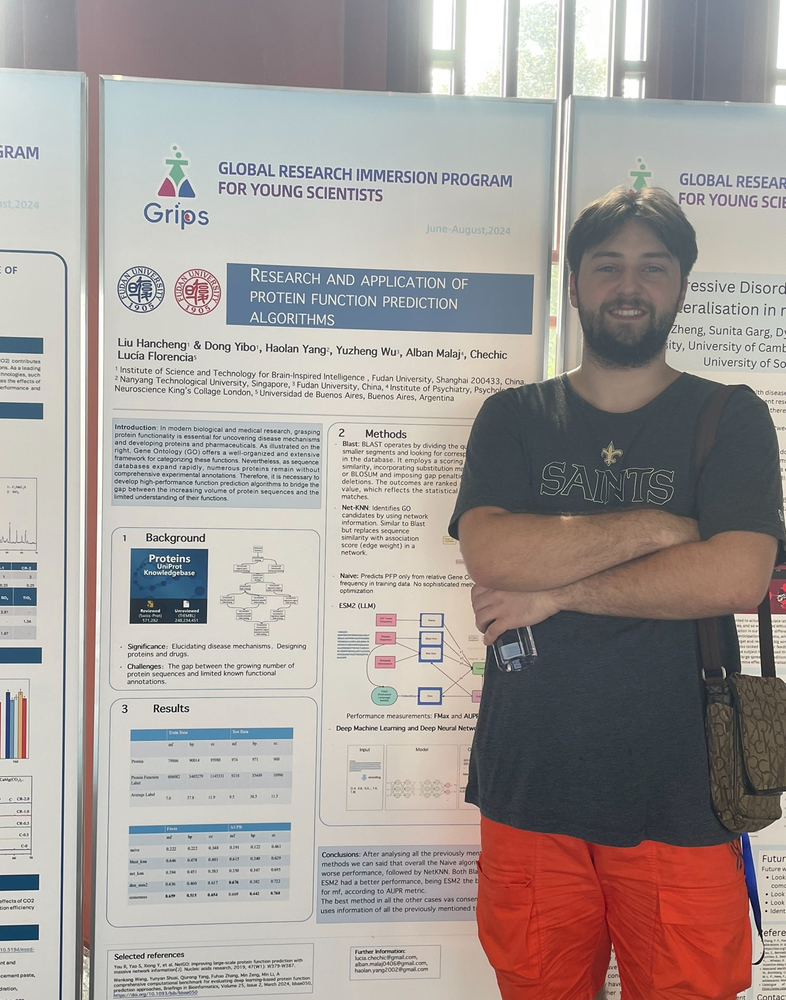

# Protein Function Prediction using Multi-Method Ensemble

A computational bioinformatics pipeline for predicting protein functions using an ensemble of sequence-based, network-based, and frequency-based methods. Developed during the **Fudan University GripS Research Program** in collaboration with researchers at **Zhejiang University**.

<p align="center">
  
  <br>
  <em>Poster presentation at Zhejiang University, China</em>
</p>

---

## Overview

Protein function prediction (PFP) is a fundamental challenge in computational biology. Given a protein sequence, the goal is to predict its biological functions using the **Gene Ontology (GO)** — a standardised vocabulary describing molecular functions, biological processes, and cellular components.

This project implements a multi-method ensemble approach that combines:
1. **Naive baseline** — Frequency-based prediction using training set statistics
2. **BLAST-KNN** — K-nearest neighbours using sequence homology via PSI-BLAST
3. **Network-KNN** — K-nearest neighbours using protein-protein interaction networks

The system was developed as part of ongoing research into improving protein function annotation, with applications to the **Critical Assessment of Functional Annotation (CAFA)** challenge.

---

> **Note on scope.** This is a team project. `evaluation_weighted.py` is inherited lab
> code (header: `@author wangsj`, 2022) and predates the programme. `net_knn.py` and
> `run.py` import a `network` module that belongs to the host lab's tree and is not
> included, so those two paths will not execute from this repository alone; the naive
> and BLAST-KNN paths are self-contained.

## Team

This project was a collaborative effort with PhD researchers:

| Name | Role |
|------|------|
| **Liu Hancheng** | Lead Researcher |
| **Dong Yibo** | Network Analysis |
| **Haolan Yang** | Data Pipeline |
| **Yuzheng Wu** | Evaluation Framework |
| **Alban Malaj** | Implementation & Analysis |
| **Lucía Florencia Chechic** | Gene Ontology Integration |

---

## Methods

### Architecture Overview

```
                    ┌─────────────────┐
                    │  Query Protein  │
                    │   (FASTA seq)   │
                    └────────┬────────┘
                             │
            ┌────────────────┼────────────────┐
            │                │                │
            ▼                ▼                ▼
    ┌───────────────┐ ┌─────────────┐ ┌──────────────┐
    │ Naive Method  │ │  BLAST-KNN  │ │ Network-KNN  │
    │ (Frequency)   │ │ (Homology)  │ │   (PPI)      │
    └───────┬───────┘ └──────┬──────┘ └──────┬───────┘
            │                │                │
            ▼                ▼                ▼
    ┌───────────────┐ ┌─────────────┐ ┌──────────────┐
    │   GO Terms    │ │  GO Terms   │ │   GO Terms   │
    │  + Scores     │ │  + Scores   │ │  + Scores    │
    └───────┬───────┘ └──────┬──────┘ └──────┬───────┘
            │                │                │
            └────────────────┼────────────────┘
                             │
                             ▼
                    ┌─────────────────┐
                    │  Gene Ontology  │
                    │   Integration   │
                    │ (Score Transfer │
                    │  & Propagation) │
                    └────────┬────────┘
                             │
                             ▼
                    ┌─────────────────┐
                    │ Final Predictions│
                    │ (Top 100 GO/NS) │
                    └─────────────────┘
```

### Method 1: Naive Baseline

The simplest approach predicts GO terms based on their frequency in the training set. While lacking protein-specific information, this provides a strong baseline due to the uneven distribution of functional annotations.

### Method 2: BLAST-KNN (Sequence Homology)

**Principle:** Proteins with similar sequences often have similar functions.

**Algorithm:**
1. Run PSI-BLAST against training protein database
2. Identify k most similar proteins (by bit score)
3. Transfer GO annotations from neighbours
4. Weight contributions by sequence similarity score

**Implementation:**
- Uses NCBI BLAST+ (v2.9.0)
- Parallelised across 40+ threads
- E-value thresholds for significance filtering

### Method 3: Network-KNN (Protein Interactions)

**Principle:** Proteins that interact often participate in related biological processes.

**Algorithm:**
1. Map query protein to protein-protein interaction network
2. Find topologically similar nodes using network BLAST
3. Transfer annotations from network neighbours
4. Weight by network proximity scores

**Data Source:** CAFA5 v11.5 network (curated biological interactions)

### Gene Ontology Integration

All methods integrate with the GO hierarchy:
- **Score propagation:** Child term predictions propagate to parent terms
- **Namespace separation:** Molecular Function (MF), Biological Process (BP), Cellular Component (CC)
- **Information Content weighting:** Rare terms weighted higher than common ones

### ESM-2 Embeddings (Experimental)

The `notebooks/` directory contains experiments with **ESM-2** (Evolutionary Scale Modeling), a protein language model from Meta AI Research:
Two ESM-2 variants are used, and they are not interchangeable:

- `esm2_t33_650M_UR50D` - 650M parameters, **1280-dim** embeddings. Used for
  per-residue representation extraction and unsupervised contact-map analysis.
- `esm2_t6_8M_UR50D` - 8M parameters, **320-dim** embeddings. Used for the
  lightweight classification-head prototype in `notebooks/`.

The notebooks here are local exploration only: the classification head is sketched
but not trained (the dataset cell is a placeholder). The full DNN-over-ESM-2 arm of
the project was run by the host lab on their cluster against the complete UniProt
set, and those results are not redistributed here.

---

## Skills & Tools

### Bioinformatics

| Technique | Description |
|-----------|-------------|
| Sequence alignment | PSI-BLAST for homology detection |
| Protein-protein interaction networks | Graph-based functional inference |
| Gene Ontology | Hierarchical annotation framework |
| CAFA evaluation | Weighted F-measure, AUPR metrics |
| Protein language models | ESM-2 embeddings for representation learning |

### Programming & Libraries

| Tool | Purpose |
|------|---------|
| **Python** | Primary implementation language |
| **PyTorch** | Deep learning framework (ESM-2) |
| **BioPython** | Sequence parsing and manipulation |
| **NCBI BLAST+** | Sequence similarity search |
| **scikit-learn** | Machine learning utilities |
| **NumPy/SciPy** | Numerical computing, sparse matrices |
| **Transformers** | HuggingFace library for ESM models |

### Computational Methods

| Method | Application |
|--------|-------------|
| K-Nearest Neighbours | Function transfer from similar proteins |
| Ensemble methods | Combining multiple prediction sources |
| Graph algorithms | Network-based similarity |
| Multi-label classification | Predicting multiple GO terms per protein |

---

## Repository Structure

```
.
├── README.md                           # This file
├── LICENSE                             # MIT License
├── report.pdf                          # Project report
├── poster_presentation.jpg             # Poster at Zhejiang University
│
├── presentations/
│   ├── grips_mini_project.pptx         # GripS program presentation
│   └── naive_algorithm.pptx            # Naive method explanation
│
├── notebooks/
│   ├── esm2_exploration.ipynb          # ESM-2 model experimentation
│   └── protein_classification.ipynb    # Neural network classifier
│
└── pfp/                                # Core prediction pipeline
    ├── run.py                          # Main orchestration script
    ├── evaluation_weighted.py          # CAFA evaluation metrics
    │
    ├── knn/                            # K-Nearest Neighbours methods
    │   ├── knn.py                      # Base KNN class
    │   ├── blast_knn.py                # Sequence homology KNN
    │   └── net_knn.py                  # Network-based KNN
    │
    ├── naive/
    │   └── naive.py                    # Frequency baseline
    │
    └── utils/
        ├── data_utils.py               # Data loading and parsing
        ├── ontology.py                 # Gene Ontology handling
        └── label_list.py               # GO term utilities
```

---

## Data & External Dependencies

**Note:** This repository contains only the source code. The following external resources are required to run the full pipeline:

| Resource | Description | Source |
|----------|-------------|--------|
| **Gene Ontology** | `go-basic.obo` hierarchy file | [Gene Ontology Downloads](http://geneontology.org/docs/download-ontology/) |
| **NCBI BLAST+** | Sequence alignment tools | [NCBI FTP](https://ftp.ncbi.nlm.nih.gov/blast/executables/blast+/LATEST/) |
| **Training Data** | Protein sequences with GO annotations | CAFA challenge data |
| **`network.py`** | PPI network loader, required by `net_knn.py` and `run.py` | Host lab internal code, not redistributed |
| **PPI Network** | Protein-protein interaction network | CAFA5 v11.5 |
| **ESM-2 Models** | Protein language model weights | [Facebook Research ESM](https://github.com/facebookresearch/esm) |

---

## References

1. You, R., Zhang, Z., Xiong, Y., Sun, F., Mamitsuka, H., & Zhu, S. (2019). **NetGO: improving large-scale protein function prediction with massive network information.** *Nucleic Acids Research*, 47(W1), W379-W387.

2. Lin, Z., Akin, H., Rao, R., et al. (2023). **Evolutionary-scale prediction of atomic-level protein structure with a language model.** *Science*, 379(6637), 1123-1130.

3. Radivojac, P., et al. (2013). **A large-scale evaluation of computational protein function prediction.** *Nature Methods*, 10(3), 221-227.

4. The Gene Ontology Consortium. (2021). **The Gene Ontology resource: enriching a GOld mine.** *Nucleic Acids Research*, 49(D1), D325-D334.

---

## Acknowledgements

- **Fudan University** — GripS Research Program
- **Zhejiang University** — Collaborative research and poster presentation venue
- **Meta AI Research** — ESM protein language models
- **CAFA Organisers** — Benchmark data and evaluation framework

---

## License

This project is licensed under the MIT License — see [LICENSE](LICENSE) for details.

---

## Author

**Alban Malaj**

*Fudan University GripS Program, 2024*
